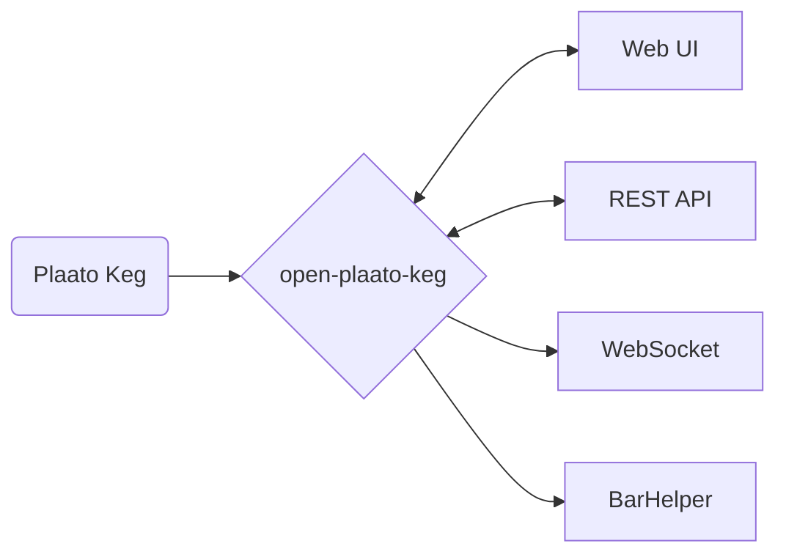

# Open Plaato Keg

Take control of your Plaato Keg. This is a local replacement for the
discontinued Plaato cloud service: it speaks the Blynk protocol your keg scale
already uses, so the hardware connects to your own server instead, with no
firmware changes.

A Go port of the original [Elixir
implementation](https://github.com/DarkJaeger/open-plaato-keg).

## How it works

The Plaato Keg was built on the Blynk IoT platform. It opens a TCP connection
to a configured host and port and pushes its readings as Blynk "virtual pin"
writes. This server decodes those writes and exposes them however you want to
consume them.



## Features

- **Keg monitoring** — remaining volume, temperature, pour detection, battery
  of scale diagnostics
- **Keg control** — tare, calibrate against a known weight, set the empty keg
  weight and full volume, switch units, choose beer or CO₂ mode, set pour
  sensitivity
- **Tap list** — a display-ready page for what is on tap, with per-tap artwork
- **Beverage library** — reusable beer records to attach to taps
- **History** — per-keg time series with charts and CSV export
- **REST API and WebSocket** — everything the UI does, available to your own
  tooling
- **BarHelper** — forwards volume readings to the BarHelper custom keg monitor
  API

## Pointing a keg at this server

The keg is configured through its own setup page; nothing about this server
needs to be registered anywhere.

1. Power on the keg. All three LEDs light up and blink slowly.
2. Turn it over and remove the yellow "Reset Key" from the bottom.
3. Hold the Reset Key in the hole marked "Reset" for about five seconds. A weak
   fridge magnet works too. The LEDs turn off and come back on.
4. Connect to the `PLAATO-XXXXX` Wi-Fi network the keg now broadcasts and open
   <http://192.168.4.1>.
5. Fill in:
   - **WiFi SSID** and **Password** — 2.4 GHz only; the keg has no 5 GHz radio
   - **Auth token** — a 32-character hex string (digits and lowercase `a`–`f`)
     of your choosing. This becomes the keg's id, so give each keg its own.
   - **Host** and **Port** — the address of this server and `KEG_LISTENER_PORT`

The same thing without the form:

```
http://192.168.4.1/config?ssid=My+Wifi&pass=my_password&blynk=00000000000000000000000000000001&host=192.168.0.123&port=1234
```

The keg appears in the web UI as soon as it connects and sends its first
reading.

## Running it

### Docker

```bash
docker run -d --name open-plaato-keg \
  -p 1234:1234 -p 8085:8085 \
  -v "$PWD/data:/db" \
  ghcr.io/matt-freed/open-plaato-keg:latest
```

The `-v` is not optional if you want your data to survive a container update.
Images are published for `linux/amd64` and `linux/arm64`, so a Raspberry Pi 4/5
on a 64-bit OS works.

### Docker Compose

See [docker-compose.yaml](docker-compose.yaml).

```bash
docker compose up -d
```

### From source

Requires Go 1.25 or newer. There is no C toolchain requirement: the SQLite
driver is pure Go.

```bash
go build ./cmd/open-plaato-keg
./open-plaato-keg
```

Then open <http://localhost:8085>.

## Configuration

Everything is configured through the environment. An invalid value stops the
server at startup rather than being silently ignored.

| Variable | Default | Description |
|---|---|---|
| `KEG_LISTENER_PORT` | `1234` | TCP port the keg hardware connects to |
| `HTTP_LISTENER_PORT` | `8085` | Port for the web UI, REST API and WebSocket |
| `DATABASE_FILE_PATH` | `/db/open-plaato-keg.db` | SQLite database. Uploaded images are stored beside it. |
| `INCLUDE_UNKNOWN_DATA` | `false` | Keep virtual pins this server does not recognise, under the keg's `extra` field |
| `LOG_LEVEL` | `info` | `debug`, `info`, `warn` or `error` |
| `BARHELPER_ENABLED` | `false` | Forward volume readings to BarHelper |
| `BARHELPER_ENDPOINT` | BarHelper's custom keg monitor URL | Override for testing |
| `BARHELPER_API_KEY` | — | Required when BarHelper is enabled |
| `BARHELPER_UNIT` | `l` | Unit sent to BarHelper; `l` is litres |
| `BARHELPER_KEG_MONITOR_MAPPING` | — | `<auth-token>:<monitor-id>` pairs, comma separated. A keg that is not listed is never forwarded. |

## API

All responses are JSON with real types: numbers are numbers, `is_pouring` is a
boolean, and a reading the device has never sent is `null` rather than zero.

### Kegs

| Method | Path | Description |
|---|---|---|
| `GET` | `/api/kegs` | Every keg, ordered for display |
| `GET` | `/api/kegs/devices` | Just the ids |
| `GET` | `/api/kegs/connected` | Ids with a live TCP connection |
| `GET` | `/api/kegs/{id}` | One keg |
| `POST` | `/api/kegs/order` | `{"ordered_ids": [...]}` — set the display order |
| `POST` | `/api/kegs/{id}/delete` | Forget a keg and its history |
| `GET` | `/api/kegs/{id}/log?range=1h\|6h\|24h\|7d\|30d` | History |
| `GET` | `/api/kegs/{id}/log/csv?range=…` | The same, as CSV |

### Keg commands

All take `POST` and return `503 not_connected` when the keg is offline, except
where noted.

| Path | Body | Notes |
|---|---|---|
| `/api/kegs/{id}/tare` | — | Momentary; follow with `tare-release` |
| `/api/kegs/{id}/tare-release` | — | |
| `/api/kegs/{id}/empty-keg` | — | Momentary; follow with `empty-keg-release` |
| `/api/kegs/{id}/empty-keg-release` | — | |
| `/api/kegs/{id}/empty-keg-weight` | `{"value": 4.5}` | |
| `/api/kegs/{id}/max-keg-volume` | `{"value": 19.0}` | |
| `/api/kegs/{id}/temperature-offset` | `{"value": -7.5}` | |
| `/api/kegs/{id}/calibrate-known-weight` | `{"value": 5.0}` | |
| `/api/kegs/{id}/unit` | `{"value": "metric"\|"us"}` | |
| `/api/kegs/{id}/measure-unit` | `{"value": "weight"\|"volume"}` | |
| `/api/kegs/{id}/keg-mode` | `{"value": "beer"\|"co2"}` | |
| `/api/kegs/{id}/sensitivity` | `{"value": "very_low"\|"low"\|"medium"\|"high"}` | |
| `/api/kegs/{id}/beer-style` | `{"value": "Saison"}` | Stored locally too; the device never reports this back |
| `/api/kegs/{id}/date` | `{"value": "12.01.2025"}` | As above |
| `/api/kegs/{id}/label` | `{"value": "Kitchen tap"}` | Stored here only |
| `/api/kegs/{id}/display-mode` | `{"value": "weight_primary"\|"percent_primary"}` | Stored here only |
| `/api/kegs/{id}/og`, `/fg`, `/co2-capacity` | `{"value": 1.050}` | Stored here only |
| `/api/kegs/{id}/abv` | `{"og": 1.050, "fg": 1.010}` | Computes and stores the strength |
| `/api/kegs/{id}/reset-last-pour` | — | Stored here only |

Numeric values may be sent as JSON numbers or as strings.

### Taps, beverages and settings

`/api/taps`, `/api/beverages` and `/api/tap-handles` are list/get/save/delete
collections. `POST` to `/api/taps/new` or `/api/beverages/new` to create one.
`/api/config` covers the home page, clock format and theme.

`GET /get_keg/{device_id}` serves an
[open-tap](https://github.com/pcurylo/open-tap) ESP32 display.

### WebSocket

`GET /ws`. Every frame is tagged:

```json
{"type": "keg", "data": { ... }}
{"type": "keg_removed", "id": "0000...0001"}
```

The current state of every keg is sent on connect, so a page does not have to
wait for the next update. Clients do not send anything.

## Development

```bash
go test ./...          # everything
go test -race ./...    # what CI runs
```

The test suite includes a recorded session from real hardware
(`testdata/capture`, 117 TCP segments). It is replayed through the framer, the
pin decoder, and the TCP server itself, which is what keeps the wire protocol
honest.

To drive a running server with that same recording:

```bash
go run ./cmd/open-plaato-keg &
go run ./cmd/kegsim -addr localhost:1234
```

`kegsim` waits for each acknowledgement before sending the next segment, the
same way the firmware does, and fails loudly if one is missing or carries the
wrong message id.

### The protocol

```
inbound frame : [cmd u8][msg_id u16be][len u16be][body len bytes]
server ack    : [0x00][msg_id u16be][0x00 0xC8]        -- exactly 5 bytes

login     : cmd 29 get_shared_dash, body = the 32-char auth token
            (cmd 2 login on older firmware)
internal  : cmd 17, body = "key\0value\0key\0value\0..."
sync      : cmd 16, body = "vr\0<pin>\0<pin>..."   (device asking us)
pin write : cmd 20, body = "vw\0<pin>\0<value>"
property  : cmd 19, body = "<pin>\0<property>\0<value>"
ping      : cmd 6, no body
```

Two details the hardware depends on:

- **The acknowledgement must echo the message id.** Older firmware checks this
  before it will consider itself connected.
- **One acknowledgement per TCP segment, not per message.** The firmware
  coalesces several messages into one segment and expects a single reply,
  carrying the first message's id.

Virtual pin numbers are documented by Plaato
[here](https://intercom.help/plaato/en/articles/5004722-pins-plaato-keg); the
mapping this server uses is in `internal/plaato/pins.go`.

## What this does not do

The Elixir original also supported Plaato Airlocks, transfer scales, MQTT,
Grainfather, Brewfather, OTA firmware serving and container self-updates. None
of that is here. Airlocks speak the same protocol and will connect, but nothing
is stored for them.

## License

See [LICENSE](LICENSE).
