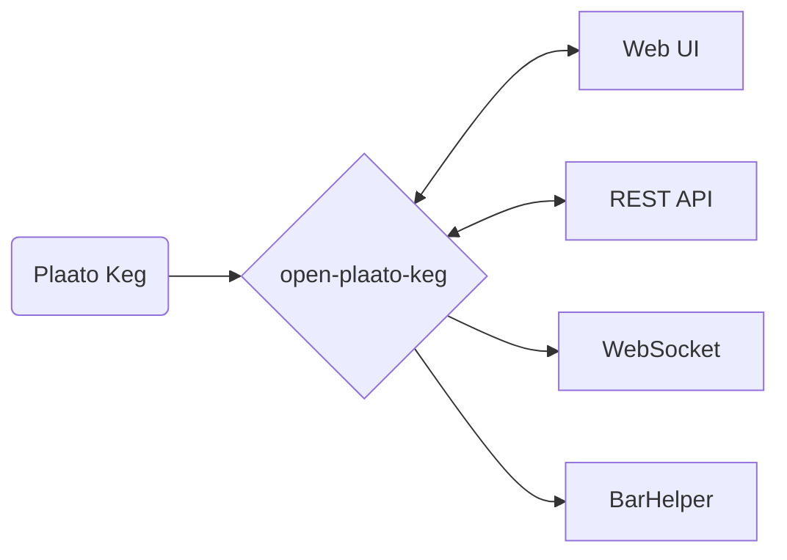

# Open Plaato Keg

Take control of your Plaato Keg. This is a local replacement for the
discontinued Plaato cloud service: it speaks the Blynk protocol your keg scale
already uses, so the hardware connects to your own server instead, with no
firmware changes.

A Go port of the original [Elixir
implementation](https://github.com/DarkJaeger/open-plaato-keg). 

## How it works

The Plaato Keg was built on the Blynk IoT platform. It opens a TCP connection
to a configured host and port and pushes its readings as Blynk "virtual pin"
writes. This server decodes those writes and exposes them however you want to
consume them.


```mermaid
graph LR
    A(Plaato Keg) --> B{open-plaato-keg};
    B <--> C[Web UI];
    B <--> D[REST API];
    B --> E[WebSocket];
    B --> F[BarHelper];
```

## Features

- **Keg monitoring** — remaining volume, temperature, pour detection, battery
  of scale diagnostics
- **Keg control** — tare, calibrate against a known weight, set the empty keg
  weight and full volume, switch units, choose beer or CO₂ mode, set pour
  sensitivity
- **Tap list** — a display-ready page for what is on tap, with a live keg
  fill gauge per beer
- **History** — per-keg time series with charts and CSV export
- **Pours** — every pour recorded with its beer, kept for good, listed per
  scale on History and across all beers on All Pours
- **REST API and WebSocket** — everything the UI does, available to your own
  tooling
- **BarHelper** — forwards volume readings to the [BarHelper custom keg
  monitor](https://docs.barhelper.app/english/settings/custom-keg-monitor) API

## Pointing a keg at this server

The keg is configured through its own setup page; nothing about this server
needs to be registered anywhere.

1. Power on the keg. All three LEDs light up and blink slowly.
2. Turn it over and remove the yellow "Reset Key" from the bottom.
3. Hold the Reset Key in the hole marked "Reset" for about five seconds. A weak
   fridge magnet works too. The LEDs turn off and come back on.
4. Connect to the `PLAATO-XXXXX` Wi-Fi network the keg now broadcasts and open
   <http://192.168.4.1>.
5. Fill in:
   - **WiFi SSID** and **Password** — 2.4 GHz only; the keg has no 5 GHz radio
   - **Auth token** — a 32-character hex string (digits and lowercase `a`–`f`)
     of your choosing. This becomes the keg's id, so give each keg its own.
   - **Host** and **Port** — the address of this server and `KEG_LISTENER_PORT`

The same thing without the form:

```
http://192.168.4.1/config?ssid=My+Wifi&pass=my_password&blynk=00000000000000000000000000000001&host=192.168.0.123&port=4545
```

The keg appears in the web UI as soon as it connects and sends its first
reading.

## Running it

### Docker

```bash
docker run -d --name open-plaato-keg \
  -p 4545:4545 -p 8085:8085 \
  -v "$PWD/data:/db" \
  ghcr.io/matt-freed/open-plaato-keg:latest
```

The `-v` is not optional if you want your data to survive a container update.
The container runs as uid 10001, so on Linux create the directory and hand it
to that user first, or the server cannot create its database:

```bash
mkdir -p data && sudo chown 10001 data
```

Images are published for `linux/amd64` and `linux/arm64`, so a Raspberry Pi 4/5
on a 64-bit OS works.

### Docker Compose

See [docker-compose.yaml](docker-compose.yaml).

```bash
docker compose up -d
```

### From source

Requires Go 1.25 or newer. There is no C toolchain requirement: the SQLite
driver is pure Go.

```bash
go build ./cmd/open-plaato-keg
./open-plaato-keg
```

Then open <http://localhost:8085>.

## Configuration

Everything is configured through the environment. An invalid value stops the
server at startup rather than being silently ignored.

| Variable | Default | Description |
|---|---|---|
| `KEG_LISTENER_PORT` | `4545` | TCP port the keg hardware connects to |
| `HTTP_LISTENER_PORT` | `8085` | Port for the web UI, REST API and WebSocket |
| `DATABASE_FILE_PATH` | `/db/open-plaato-keg.db` | SQLite database. |
| `INCLUDE_UNKNOWN_DATA` | `false` | Keep virtual pins this server does not recognise, under the keg's `extra` field |
| `LOG_RETENTION_DAYS` | `365` | Days of keg history (`keg_log`) to keep; `0` keeps it forever. Pours are never pruned. |
| `LOG_COMPACT_AFTER_DAYS` | `30` | Days of full 1-minute history to keep before older readings are combined into hourly averages; `0` never combines. |
| `LOG_LEVEL` | `info` | `debug`, `info`, `warn` or `error` |
| `BARHELPER_ENABLED` | `false` | Forward volume readings to BarHelper |
| `BARHELPER_ENDPOINT` | BarHelper's custom keg monitor URL | Override for testing |
| `BARHELPER_API_KEY` | — | Required when BarHelper is enabled |
| `BARHELPER_UNIT` | `l` | Unit sent to BarHelper; `l` is litres |
| `BARHELPER_KEG_MONITOR_MAPPING` | — | `<auth-token>:<monitor-id>` pairs, comma separated. A keg that is not listed is never forwarded. |

A scale reports continuously — dozens of readings a second during a pour —
while BarHelper accepts only two updates a minute, and that limit applies to
the API key as a whole rather than to each monitor. Sending is therefore
shaped in three stages:

- Readings are **coalesced**: only the most recent volume per monitor is kept,
  so nothing queues up and the value that eventually goes out is the one the
  keg settled on.
- Each monitor sends **at most once every 30 seconds**, and an unchanged volume
  is not re-sent.
- A **shared budget** of two sends per minute covers every monitor together,
  handed to whichever monitor has waited longest.


The API key and the monitor ids come from BarHelper's own [custom keg monitor
settings](https://docs.barhelper.app/english/settings/custom-keg-monitor).
Create a monitor there for each tap, then map each keg's auth token to the
monitor id it should update.

## The web UI

Plain HTML and JavaScript with no build step, embedded into the binary. `/`
redirects to whichever page is set as home — the tap list unless you change it.

| Page | Description |
|---|---|
| `/taplist.html` | **Tap List** — the display page, meant to be left on a screen. A responsive grid with a tile per tap: beer name, style, ABV and IBU, the description (up to two lines), the linked keg's name and temperature (to the nearest degree), the tap's kegged date and how many days ago that was, and a keg graphic filled to the percentage remaining in the drink's colour, with the amount left beneath it, or the percentage if Dashboard Setup says so (a tap with no keg linked is drawn full); clear drinks are drawn as a faint tint. Amounts and temperatures are in the chosen display units. Drag a tile (press and hold on a touch screen) to rearrange; the new order is saved as the taps' numbers. WebSocket updates and a full reload every minute. |
| `/kegs.html` | **Kegs** — a tile per scale in the tap list's style, showing what is left, the percentage, temperature, the last recorded pour and when it was, the beer on the tap it feeds and a pouring indicator, drawn as a keg in the beer's colour or as a CO₂ cylinder depending on the mode. Under the name, it shows when the scale last sent data and when BarHelper last accepted a reading from it; the top row shows its Wi-Fi strength while it is connected. Drag the tiles to reorder them. |
| `/keg-setup.html` | **Keg Setup** — a list of every scale the server knows, marked connected or offline; choose one to open its settings on their own view (the URL keeps the open scale, so Back and reload work). The settings cover everything the device can be told: units and weight-or-volume display, tare, calibration against a known weight, empty keg weight, full volume, temperature offset and pour sensitivity, plus beer or CO₂ mode. Also shows scale information. Settings sent to the scale itself need it connected; an offline scale says so, and can still be relabelled or forgotten. |
| `/history.html` | **History** — pick a scale and a range from 1 hour to 1 year, or Custom to choose a start and end date and time; anything longer than a day is averaged so the charts stay quick. A summary gives what was poured and how many pours, what is left now and the temperature; below it, amount left (or percent) and temperature are charted on one time axis, with pours marked, and a table lists the range's pours, each of which can be deleted. The amount chart's axis fits the range shown by default, so small pours from a full keg are easy to see; Full starts it at zero. The URL keeps the scale and range, and the same readings download as CSV. Clear history deletes all of a scale's readings and takes its pours off this page (they stay on All Pours), after asking first. Edit opens the range's stored readings for editing. |
| `/history-edit.html` | **Edit History** — opened from History's Edit button on the scale and range shown there. Lists the stored readings, unaveraged, 100 at a time; Earlier and Later page through the range. Amount left, temperature, percent left and pouring can be edited (an empty cell clears a value) and saved together; time and scale cannot. Amounts and temperatures are in the display units and are converted back to the scale's own units when saved. Rows ticked with the checkboxes can be deleted. Recorded pours are not changed by either. |
| `/pours.html` | **All Pours** — linked from History. Every pour from every scale, newest first, with its time, beer, style, ABV, scale, how long it took and amount, over 24 hours to all time. Filter by beer or scale; a summary gives the count, the total and a per-beer breakdown. Pours can be deleted, and the list downloads as CSV. |
| `/taplist-setup.html` | **Tap List Setup** — a list of your taps; choose one, or add a new one, to open the tap editor on its own view (the URL keeps the open tap, so Back and reload work). The editor covers the tap number, beer details including colour (an SRM, or a named colour such as clear for sparkling water), the date kegged (picked from a calendar and kept on the tap), and the keg the tap draws from. |
| `/dashboard-setup.html` | **Dashboard Setup** — appearance and preferences for every page: page, card and text colours and the font, an accent colour, separate tap list title and body faces, which page is home, 12- or 24-hour times, display units, and whether keg graphics show the amount or the percentage left, and the minimum pour. Each change saves as it is made, and the page previews colours and fonts on itself as you choose them; screens already open pick a change up when they reload. |

## API

All responses are JSON with real types: numbers are numbers, `is_pouring` is a
boolean, and a reading the device has never sent is `null` rather than zero.

### Kegs

| Method | Path | Description |
|---|---|---|
| `GET` | `/api/kegs` | Every keg, ordered for display |
| `GET` | `/api/kegs/devices` | Just the ids |
| `GET` | `/api/kegs/connected` | Ids with a live TCP connection |
| `GET` | `/api/kegs/{id}` | One keg |
| `POST` | `/api/kegs/order` | `{"ordered_ids": [...]}` — set the display order |
| `POST` | `/api/kegs/{id}/delete` | Forget a keg and its history |
| `GET` | `/api/kegs/{id}/log?range=1h\|6h\|24h\|7d\|30d\|90d\|180d\|1y` | History. `?from=<unix>&to=<unix>` asks for a custom window instead. Longer than a day it is averaged to at most 1,440 points; `X-Log-Step-Seconds` gives the step (0 when every reading is sent) |
| `GET` | `/api/kegs/{id}/log/csv?range=…` | The same range as CSV, every stored row, not averaged |
| `POST` | `/api/kegs/{id}/log/clear` | Delete every reading recorded for the keg, in every range, and hide its pours from its history; the keg itself is kept |
| `GET` | `/api/kegs/{id}/log/rows?from=<unix>&to=<unix>` | One page of stored readings for editing, oldest first, not averaged, in the display units: `{"entries", "has_earlier", "has_later", "amount_unit", "temperature_unit"}`. `&limit=` (default 100, at most 500); `&after=<unix>` or `&before=<unix>` moves the page |
| `POST` | `/api/kegs/{id}/log/update` | `{"entries": [{"timestamp": …, "amount_left": …}]}` — change stored readings. Each entry carries only the values to change, in the display units; `null` clears one. A reading that no longer exists is a 409 and nothing is changed |
| `POST` | `/api/kegs/{id}/log/delete` | `{"timestamps": [...]}` — delete those readings; the keg's pours are kept |
| `GET` | `/api/kegs/{id}/pours?range=1h\|6h\|24h\|7d\|30d\|90d\|180d\|1y` | The keg's pours, newest first. Also takes `?from=&to=` |

### Pours

A pour is one pouring window reported by the scale: it starts when `is_pouring`
turns on and ends when it turns off (or the scale disconnects), and its size is
how much the amount left fell in between. It is recorded only if it is at least
the minimum pour set at that moment and no more than 128 fl oz, so scale jitter
never counts. Each pour keeps its own copy of the beer's name, style, ABV, tap
number and scale label, and pours are never pruned.

| Method | Path | Description |
|---|---|---|
| `GET` | `/api/pours?range=24h\|7d\|30d\|90d\|1y\|all` | Every pour from every keg, newest first, including those hidden from a cleared scale's history (`hidden_from_keg`). Each carries a `display` block with its size in the display units |
| `GET` | `/api/pours/csv?range=…` | The same, as CSV, in the units each scale reported |
| `POST` | `/api/pours/{id}/delete` | Delete one pour everywhere |

### Keg commands

All take `POST` and return `503 not_connected` when the keg is offline, except
where noted.

| Path | Body | Notes |
|---|---|---|
| `/api/kegs/{id}/tare` | — | Momentary; follow with `tare-release` |
| `/api/kegs/{id}/tare-release` | — | |
| `/api/kegs/{id}/empty-keg` | — | Momentary; follow with `empty-keg-release` |
| `/api/kegs/{id}/empty-keg-release` | — | |
| `/api/kegs/{id}/empty-keg-weight` | `{"value": 4.5}` | |
| `/api/kegs/{id}/max-keg-volume` | `{"value": 19.0}` | |
| `/api/kegs/{id}/temperature-offset` | `{"value": -7.5}` | |
| `/api/kegs/{id}/calibrate-known-weight` | `{"value": 5.0}` | |
| `/api/kegs/{id}/unit` | `{"value": "metric"\|"us"}` | |
| `/api/kegs/{id}/measure-unit` | `{"value": "weight"\|"volume"}` | |
| `/api/kegs/{id}/keg-mode` | `{"value": "beer"\|"co2"}` | |
| `/api/kegs/{id}/sensitivity` | `{"value": "very_low"\|"low"\|"medium"\|"high"}` | |
| `/api/kegs/{id}/label` | `{"value": "Kitchen tap"}` | Stored here only |
| `/api/kegs/{id}/co2-capacity` | `{"value": 1.050}` | Stored here only |
| `/api/kegs/{id}/reset-last-pour` | — | Stored here only |

Numeric values may be sent as JSON numbers or as strings.

### Taps

| Method | Path | Description |
|---|---|---|
| `GET` | `/api/taps` | Every tap, by tap number, unnumbered ones last |
| `GET` | `/api/taps/{id}` | One tap |
| `POST` | `/api/taps/new` | Create one; the response carries the generated id |
| `POST` | `/api/taps/order` | `{"ordered_ids": [...]}` — renumber the named taps 1..n in that order; an unknown id changes nothing and is a 404 |
| `POST` | `/api/taps/{id}` | Save one. A `keg_id` another tap already uses is a 409 (`keg_in_use`) naming that tap |
| `POST` | `/api/taps/{id}/delete` | Delete one |

A tap body takes these fields, all optional:

| Field | Type | Notes |
|---|---|---|
| `tap_number` | number | Orders the tap list; `null` sorts last. Rewritten by `/api/taps/order` |
| `name`, `brewery`, `style` | string | |
| `abv`, `ibu` | number | |
| `srm` | number | Beer colour; the tap list fills the keg graphic in it. Must not be negative |
| `color_preset` | string | A named colour for drinks SRM cannot describe: `clear`, `pink`, `red`, `purple`, `green` or `blue`. Set this or `srm`, not both |
| `color` | string | Colour from before `srm` existed, used only when neither `srm` nor `color_preset` is set; defaults to `#c9a849` |
| `description`, `tasting_notes` | string | |
| `kegged_date` | string | When the beer was kegged, as `YYYY-MM-DD` or `DD.MM.YYYY`; stored as `YYYY-MM-DD`. Anything that is not a real date is a 400; empty means none |
| `keg_id` | string | The keg this tap draws from, so the card can show what is left. A keg feeds at most one tap |

### Settings

| Method | Path | Body | Description |
|---|---|---|---|
| `GET` | `/api/config` | — | Home page, clock format, display units, amount display, minimum pour and theme together |
| `GET` `POST` | `/api/config/home-page` | `{"home_page": "taplist"\|"kegs"}` | Where `/` sends the browser |
| `GET` `POST` | `/api/config/time-format` | `{"time_format": "12h"\|"24h"}` | How times are shown, such as on the history page |
| `GET` `POST` | `/api/config/display-units` | `{"system": "device"\|"metric"\|"us", "measure": "device"\|"weight"\|"volume"}` | How the UI presents readings. Display only: storage and BarHelper stay in the scale's own units |
| `GET` `POST` | `/api/config/amount-display` | `{"amount_display": "amount"\|"percent"}` | Which figure every keg graphic shows large on the tap list and the Kegs page. CO₂ cylinders always show the amount |
| `GET` `POST` | `/api/config/min-pour` | `{"value": 2, "unit": "oz"\|"ml"}` | The smallest pouring window recorded as a pour; default 2 oz. Changing it only affects future pours |
| `GET` `POST` | `/api/config/theme` | A theme object | Colours and fonts |
| `GET` | `/theme.css` | — | The stored theme as CSS custom properties, which `style.css` and the tap list consume |
| `GET` | `/api/alive` | — | Status and server version |

An unrecognised `home_page` or `time_format` falls back to the default rather
than being rejected. The theme accepts `accent_color`, `bg_color`, `card_bg`,
`text_color`, `font_family`, `taplist_title_font` and `taplist_body_font`;
anything else is ignored, and a value
that could break out of the stylesheet is dropped. A named font is fetched from
Google Fonts and falls back to the system font; `System` uses the system font
directly.

### WebSocket

`GET /ws`. Every frame is tagged:

```json
{"type": "keg", "data": { ... }}
{"type": "keg_removed", "id": "0000...0001"}
```

The current state of every keg is sent on connect, so a page does not have to
wait for the next update. Clients do not send anything.

## Development

```bash
go test ./...          # everything
go test -race ./...    # what CI runs
```

The test suite includes a recorded session from real hardware
(`testdata/capture`, 117 TCP segments). It is replayed through the framer, the
pin decoder, and the TCP server itself, which is what keeps the wire protocol
honest.

To drive a running server with that same recording:

```bash
go run ./cmd/open-plaato-keg &
go run ./cmd/kegsim -addr localhost:4545
```

`kegsim` waits for each acknowledgement before sending the next segment, the
same way the firmware does, and fails loudly if one is missing or carries the
wrong message id.

The recording logs in as keg `00000000000000000000000000000001`. Pass
`-token <32 characters>` to replay it as a different keg instead.

### Demo data

`testdata/demo.sql` fills a database with six kegs on eight taps, enough to see
the tap list and keg pages populated without any hardware, and sets the display
units to US. It also generates 30 days of history for every keg, ending at the
moment it is loaded, so the History page has pours, keg swaps and temperature
to chart in every range, and All Pours has a month of pours to list. It holds data only, so load it on top of the schema:

```bash
mkdir -p data
cat internal/store/schema.sql testdata/demo.sql | sqlite3 data/demo.db
DATABASE_FILE_PATH=data/demo.db go run ./cmd/open-plaato-keg
```

Then open <http://localhost:8085>. The readings are a snapshot and stay put
until a keg reports new ones, and the history ages with them: reload the demo
to bring it up to date. `data/` is gitignored; delete `data/demo.db` and
rerun the `cat` line to start over.

To see live traffic on the tap list, replay the recording against the demo:

```bash
go run ./cmd/kegsim -addr localhost:4545 -pause 1s -loop
```

The recording logs in as keg 1, the keg on the Red Barn Amber tap, so that tap
updates as each segment arrives. The recorded scale sat at room temperature
and was loaded and emptied three times, so the level climbs (to at most 39%)
and drops back to empty three times in each two-minute pass. To leave the six
demo kegs alone, add `-token 00000000000000000000000000000007` and the
recording arrives as a seventh keg on no tap.

### The protocol

```
inbound frame : [cmd u8][msg_id u16be][len u16be][body len bytes]
server ack    : [0x00][msg_id u16be][0x00 0xC8]        -- exactly 5 bytes

login     : cmd 29 get_shared_dash, body = the 32-char auth token
            (cmd 2 login on older firmware)
internal  : cmd 17, body = "key\0value\0key\0value\0..."
sync      : cmd 16, body = "vr\0<pin>\0<pin>..."   (device asking us)
pin write : cmd 20, body = "vw\0<pin>\0<value>"
property  : cmd 19, body = "<pin>\0<property>\0<value>"
ping      : cmd 6, no body
```

Two details the hardware depends on:

- **The acknowledgement must echo the message id.** Older firmware checks this
  before it will consider itself connected.
- **One acknowledgement per TCP segment, not per message.** The firmware
  coalesces several messages into one segment and expects a single reply,
  carrying the first message's id.

Virtual pin numbers are documented by Plaato
[here](https://intercom.help/plaato/en/articles/5004722-pins-plaato-keg); the
mapping this server uses is in `internal/plaato/pins.go`.

## What this does not do

The Elixir original also supported Plaato Airlocks, transfer scales, MQTT,
Grainfather, Brewfather, OTA firmware serving and container self-updates. None
of that is here. Airlocks speak the same protocol and will connect, but nothing
is stored for them.
