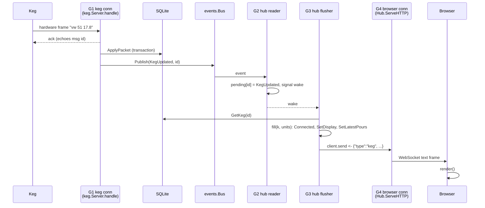

# From keg reading to browser

This follows one reading — "17.8 left" — from a Plaato Keg's TCP socket to a
tile on the Kegs page, and explains why the path is shaped the way it is.

## Overview

Four kinds of goroutine are involved. Every handoff between them is either a
buffered channel with a non-blocking send or a mutex-guarded map, so no stage
ever waits on the one after it.

```
 G1 keg connection        G2 hub reader       G3 hub flusher          G4 browser connection
 (one per keg)            (one)               (one)                   (one per open tab)
 ─────────────────        ─────────────       ──────────────          ─────────────────────
 Read → Feed → ack
 Decode → ApplyPacket
 Publish ──(bus, 32)──►   mark ──(pending map + wake)──► flush → GetKeg
                                                          Broadcast ──(client.send, 16)──► Write → browser
```



## Step by step

### 1. Bytes arrive — `internal/keg/server.go`, `handle` (G1)

The scale writes one Blynk hardware frame:

```
14 00 2a 00 0a  76 77 00 35 31 00 31 37 2e 38
│  └─┬─┘ └─┬─┘  └──────────── body ────────────┘
│  msgID  length           "vw\0 51\0 17.8"
cmd 20 (hardware)  42       10
```

`nc.Read` returns those 15 bytes. Each read has a 60 second deadline; the
firmware heartbeats every 20 seconds, so a minute of silence means the device
is gone.

### 2. Framing — `internal/blynk/framer.go`, `Framer.Feed`

`Feed` appends the bytes to its buffer and slices off every complete frame. The
header says the body is 10 bytes and all 10 are present, so it returns
`[Frame{Cmd: 20, MsgID: 42, Body: "vw\x0051\x0017.8"}]`. A frame split across
reads is held in the buffer until the rest arrives.

### 3. Acknowledgement — `handle`

`blynk.ResponseSuccess(42)` → `00 00 2a 00 c8` is written back through
`Conn.Send`, which serialises writes with the commander. There is one
acknowledgement per read, echoing the first frame's message id; the firmware
depends on both. The ack goes out *before* the data is processed, so the device
is never kept waiting on storage or broadcasting.

### 4. Decoding — `internal/plaato/decode.go`, `Decode`

`splitBody` gives `["vw", "51", "17.8"]`. Pin 51 in `hardwarePins`
(`pins.go`) is `amount_left`, a float, so the result is
`Packet{Props: [{Name: "amount_left", Value: 17.8}]}`.

### 5. Gatekeeping — `keg/server.go`, `ingest`

The connection registered its keg id when the device logged in, and it is
already confirmed as a keg (`amount_left` is itself a keg-identifying pin).
Unconfirmed devices get no further than this.

### 6. Persistence — `internal/store/apply.go`, `ApplyPacket` → `keg.go`, `updateKegTx`

In one transaction: `SELECT` the keg row, apply the `amount_left` setter from
`kegSetters`, stamp `last_seen` (only `ApplyPacket` does; API edits through
`UpdateKeg` leave it alone), run `trackPour` (`pour.go`), derive
`beer_left_unit`, then `INSERT OR REPLACE` and `COMMIT`. `trackPour` notes the
start of a pouring window when `is_pouring` turns on and, when it turns off,
inserts a `pours` row in the same transaction if the drop clears the minimum
pour. A plain amount reading like this one, outside a pouring window, never
creates a pour. No WebSocket frame announces a new pour; the History and All
Pours pages read pours when they load. The store has a single SQLite connection, so
this queues behind any API query already running.

### 7. Side effects — `ingest` (still G1)

- `LogThrottle.Allow` → possibly one `keg_log` row (at most one per keg per minute).
- **`bus.Publish(Event{KegUpdated, id})`** — the handoff. A non-blocking send
  into the hub's 32-slot subscription channel.
- `KegAmount` → BarHelper's in-memory latest value (off this path).

G1 then loops back to `Read`.

### 8. Recording — `internal/ws/hub.go`, `Run`'s reader goroutine (G2)

Receives the event and calls `mark`: `pending[id] = KegUpdated` under a mutex,
then a non-blocking send on `wake`, a channel with a one-slot buffer.

### 9. Flushing — `hub.go`, `flush` (G3)

Woken, it calls `takePending()` to swap the map out, then:

- if no browsers are connected, discards the batch without touching the database;
- reads the display-unit preference once for the batch;
- re-reads the **whole** keg with `store.GetKeg(id)` — the event carried only an
  id, so the message carries whatever is stored now;
- calls `fill`, which sets `connected` from the connection registry, calls
  `k.SetDisplay(units)` to add the `display` block, and calls
  `store.SetLatestPours` to add `latest_pour`, the newest pour in the keg's
  history. The top-level fields stay in the device's own units. A pour is
  recorded in the same transaction as the packet that ends it, so the update
  that packet triggers already carries the new pour. The snapshot a newly connected tab is sent goes
  through `fill` too, so every keg frame carries the same `connected` the REST
  API returns.

### 10. Broadcast — `hub.go`, `Broadcast` (G3)

Builds `Message{Type: "keg", Data: k}` and does a non-blocking send into each
client's 16-slot `send` channel.

### 11. Socket write — `hub.go`, `ServeHTTP` (G4, one per tab)

Pulls the message from `c.send`, marshals it and writes it with a 10 second
timeout:

```json
{"type":"keg","data":{"id":"a1b2…","amount_left":17.8,"is_pouring":true, …,
  "display":{"amount_left":4.7,"amount_unit":"gal", …}}}
```

### 12. Render — `web/static/kegs.html`

The `message` listener parses the frame, sees `type === "keg"`, stores
`msg.data` in its map of kegs and calls `render()`. That updates the scale's
tile in place with `updateTile`, so the keg graphic's level animates to the new
reading, and keeps the tiles in their display order.

## Why the hub uses two goroutines

Receiving an event is cheap; acting on it is not. A flush reads the database
through the one SQLite connection it shares with every keg's writes and every
API request. When all kegs reconnect at once, that read waits behind a queue of
write transactions.

If one goroutine both received and flushed, the bus channel would go unread for
the duration of every slow flush. `Publish` never blocks — it must not stall
ingest — so once the 32 slots filled, events would be dropped. A dropped event
can be a lost update: if it was the last one for a keg, the browser keeps
showing a stale value until that keg next changes, which for an idle keg may be
a long time. This is what happened before the split.

With the split:

- **G2 only writes a map**, so it keeps the bus drained however slow G3 is.
- **The backlog is bounded by the number of kegs**, not the event rate. Five
  hundred events for ten kegs are ten map entries.
- **Coalescing loses nothing**, because each message is a full snapshot read at
  flush time. Five events for one keg need one `GetKeg`.
- **No update is missed.** `ApplyPacket` commits before `Publish`, and `mark`
  writes the map before signalling `wake`. Any change is therefore either
  picked up by a `takePending` still to come, or leaves a wake token that
  causes another flush after the current one.

Alternatives and why they fall short:

| Alternative | Problem |
|---|---|
| A bigger bus buffer | Any fixed buffer can overflow in a large enough burst |
| One goroutine that drains the channel before each flush | The channel is still unread *during* a slow flush |
| Coalescing inside the bus | The bus is a general fan-out; coalescing is only correct for a subscriber that re-reads full state |

## How many entries a flush sees

Signalling `wake` makes G3 runnable; it does not run it on the spot. G2 can
record several events before G3 is scheduled, and if G3 is mid-flush,
everything that arrives meanwhile collects behind a single wake token:

```
G3: takePending() → {A}; GetKeg(A) … waiting on the database …
G2: mark(B) → wake sent (slot was empty)
G2: mark(C) → slot full, skipped
G2: mark(B) → overwrites B
G3: … broadcasts A, returns
G3: sees the buffered wake → takePending() → {B, C}
```

| Load | Typical entries per flush |
|---|---|
| One keg idle, occasional reading | 1 |
| One keg mid-pour | usually 1 — its own repeats collapse |
| Several kegs reporting | often 2 or more |
| Everything reconnecting | up to the number of kegs |

The same timing can leave a wake token with nothing behind it, when an event is
recorded after the wake was consumed but before `takePending` swapped the map.
`takePending` and `flush` both return early on an empty map, so the spare flush
costs nothing.

## Where a reading can stop

| Point | What happens |
|---|---|
| Framing: body length over `MaxBodySize` | Connection closed |
| Device not yet confirmed as a keg | Metadata buffered; nothing stored or broadcast |
| Database error in `ApplyPacket` | Logged; nothing published |
| Bus subscription full | Event dropped with a warning (rare, since G2 only writes a map) |
| No browsers connected | Batch discarded before any database read |
| Keg deleted before the flush | Skipped |
| A tab's `send` buffer full | Message dropped for that tab; its next message corrects it |
| Socket write fails or times out | That tab's connection is closed |

## Other sources on the same path

Steps 7 to 12 are shared by everything that publishes a keg event:

- **A keg disconnecting** — `finish` clears the pouring flag with `SetPouring`,
  which also ends and records any pour in progress, and publishes `KegUpdated`.
- **An edit in the UI** — `internal/api/kegs.go` updates the store and publishes
  `KegUpdated`.
- **Deleting a keg** — `internal/api/kegs.go` publishes `KegRemoved`. The flush
  skips the database read and broadcasts `{"type":"keg_removed","id":…}`, and
  the Kegs page removes the scale's tile.

A newly opened tab does not wait for this path: `ServeHTTP` immediately sends it
a snapshot of every keg from `ListKegs`, then it receives updates like any other
client.

## Known gaps

- `keg-setup.html` does not reconnect when the socket closes, so it shows stale
  data after a server restart until the page is reloaded. `taplist.html` and
  `kegs.html` retry every five seconds.
- The comment on `clientBuffer` says a client that falls behind is
  disconnected; the code drops messages for it instead and leaves it connected.
- A tab's initial snapshot uses the same 16-slot buffer, so with more than 16
  kegs some tiles may be missing until those kegs next report.
